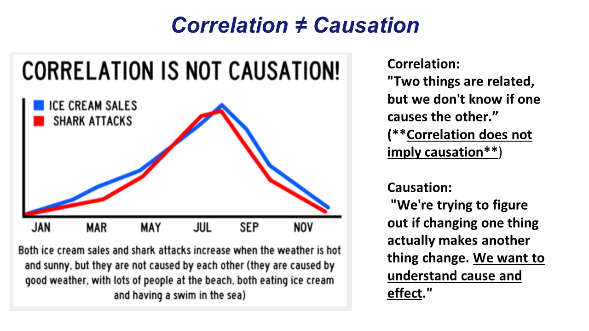
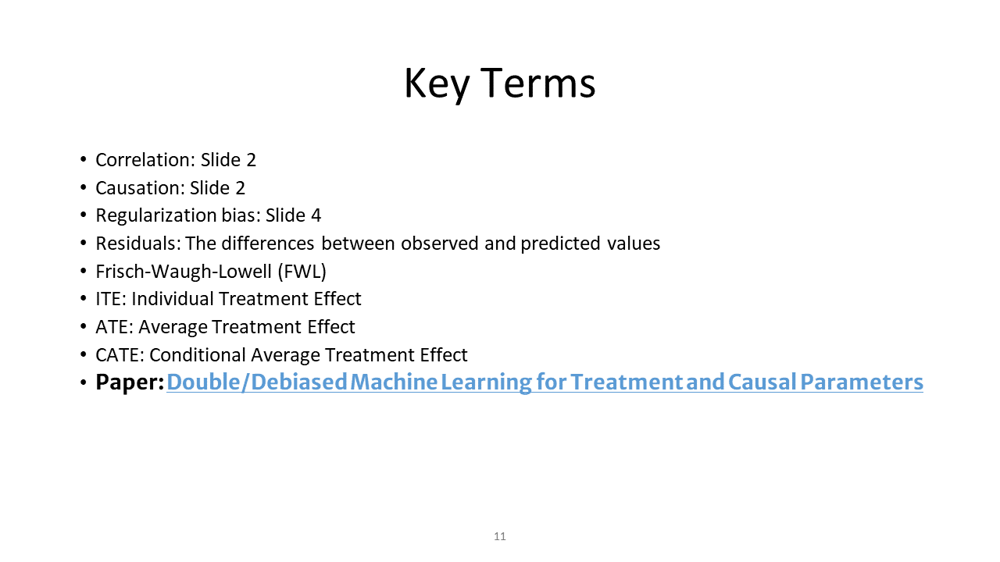

<!-- Notes:
setting the ouptut to slidy_presentation with a css style allows me to use css to customize my rmd filde.
for example I was able to comment the author title above, and I have been able to make all the slide names white so that the only the images from my powerpoint show but the white text allows the user to select the content option and see the titles for each slide that I made white

I am rendering powerpoint presentation images (powerpoint is avaible in my project directory), but a user can also create their own slides (insructions on how to do this are able to be found through google searches)


-->

```{r setup, include=FALSE}
knitr::opts_chunk$set(echo = FALSE)
```

## [Use Cases]{style="color:white;"}

{width="100%"}

## [Road Map]{style="color:white;"}

{width="100%"}

## [Correlation ≠ Causation]{style="color:white;"}

{width="100%"}

## [Finding Causality]{style="color:white;"}

{width="100%"}

## [Regularization Bias in Simple Terms]{style="color:white;"}

{width="100%"}

## [Regularization Bias]{style="color:white;"}

{width="100%"}

## [Double Machine Learning]{style="color:white;"}

{width="100%"}

## [FWL Theorem]{style="color:white;"}

{width="100%"}

## [FWL proof]{style="color:white;"}

{width="100%"}

## [DML Result]{style="color:white;"}

{width="100%"}

## [Conclusion]{style="color:white;"}

{width="100%"}
